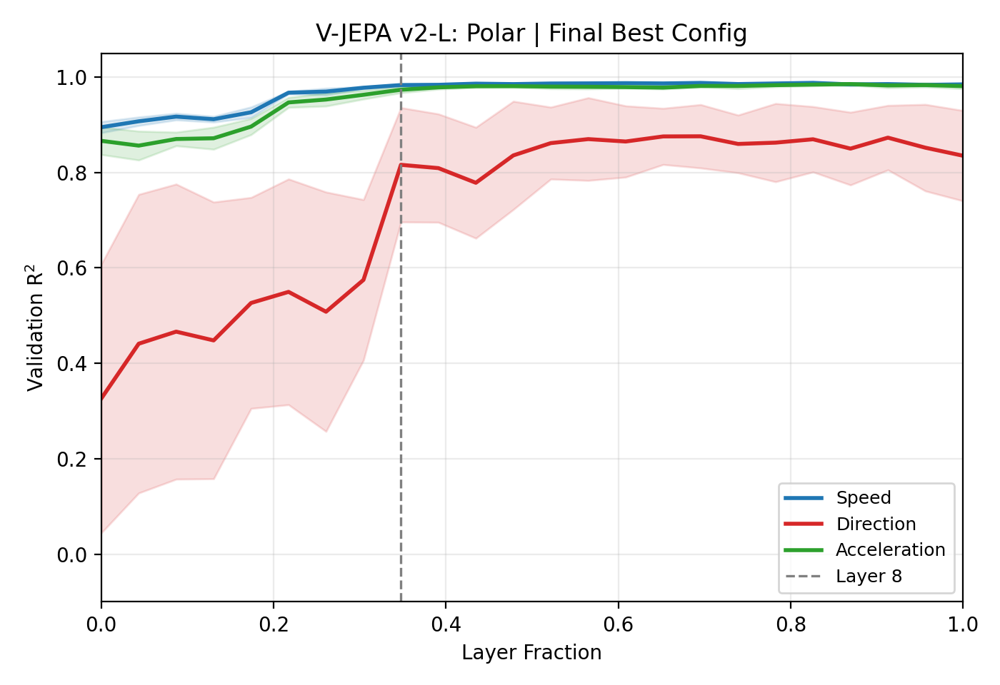
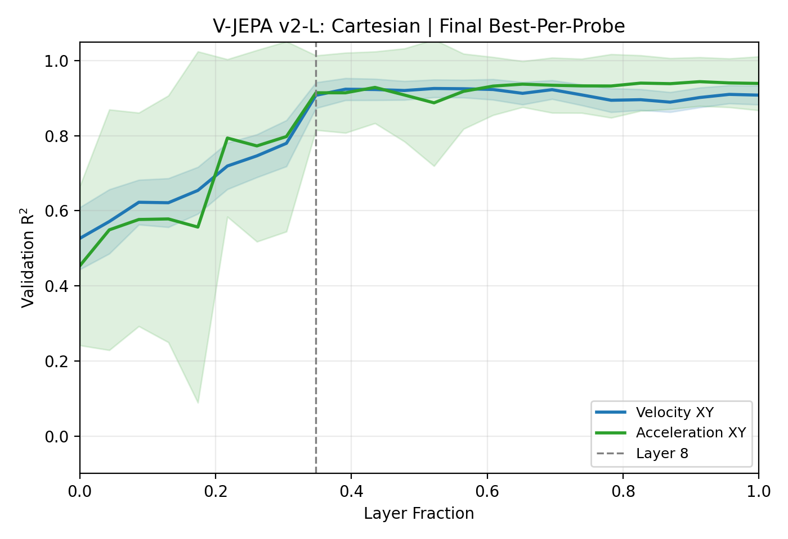
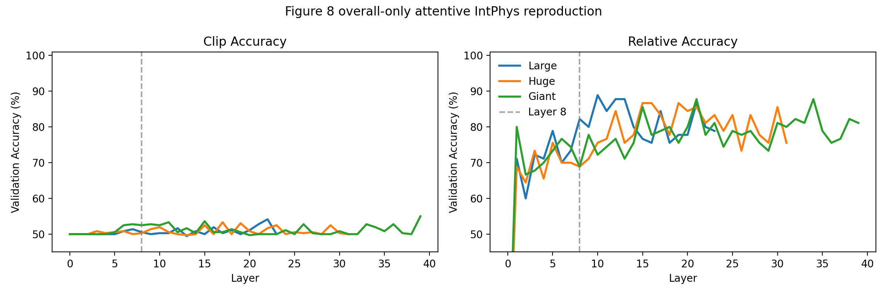

# Reproduction of [Interpreting Physics in Video World Models]

[](https://arxiv.org/abs/2602.07050)
[](https://github.com/facebookresearch/vjepa2)
[](#tldr--reproduction-status)

> A faithful reproduction of the **Physics Emergence Zone (PEZ)** findings from META Superintelligence Lab's paper on V-JEPA 2.

**Paper**: [Interpreting Physics in Video World Models](https://arxiv.org/abs/2602.07050) (META Superintelligence Lab, 2026)  
**Local copy**: [pez_paper.pdf](./pez_paper.pdf)  
**Model**: V-JEPA 2 (Large / Giant / Huge) — [facebookresearch/vjepa2](https://github.com/facebookresearch/vjepa2)

**Keywords**: `V-JEPA 2` · `Physics Emergence Zone` · `PEZ` · `video world models` · `interpretability` · `linear probing` · `attentive probing` · `IntPhys` · `Kubric` · `META Superintelligence Lab` · `reproduction study`

## What is the Physics Emergence Zone (PEZ)?

The paper shows that in self-supervised video world models like V-JEPA 2, **physical concepts such as direction-of-motion emerge abruptly at roughly one-third of network depth** — not gradually, and not at the input. Scalar magnitudes (speed, acceleration) are linearly decodable from the input, but direction only becomes linearly available at an intermediate "zone" (around layer 8 in V-JEPA 2 Large). This repository reproduces that finding and probes how much of the paper's pipeline is actually specified in public materials.

---

## TL;DR — Reproduction Status

| Paper Figure | What it shows | Status | Reproduced quality |
|---|---|---|---|
| **Figure 1** (IntPhys possible/impossible) | Binary discrimination task | ✅ Qualified | Peak 100% on dev set with pair-wise scene-relative metric |
| **Figure 2(c)** (Polar probes) | Direction/speed/accel layer-wise R² | ✅ Qualified | Layer-8 onset and paper-like middle-layer peak |
| **Figure 2(b)** (Cartesian probes) | `(vx, vy)` / `(ax, ay)` layer-wise R² | ⚠️ Partial | No single config matches both probes simultaneously |
| **Figure 6** (Linear probe × model size) | IntPhys across L/G/H | ⚠️ Overall-only | Large/Giant/Huge overall row reproduced; subtask rows blocked |
| **Figure 8** (Attentive probe × model size) | IntPhys across L/G/H | ⚠️ Overall-only | Large/Giant/Huge overall attentive curves reproduced |

What `Qualified`, `Partial`, and `Overall-only` mean is defined in [Section 3](#3-reproduction-quality-levels).

## Headline Figures


> Pair-wise scene-relative accuracy on IntPhys dev. This reproduction shows a sharp PEZ-style transition once the metric matches the benchmark structure rather than plain clip accuracy.


> Speed, direction, and acceleration magnitude across layers for V-JEPA 2 Large. Direction emerges sharply at layer 8, while scalar magnitudes are linearly available from the input.


> Cartesian velocity and acceleration probes are partially matched. The best local reproduction requires different configs for the two probes, which is why this panel is marked partial rather than qualified.


> Overall IntPhys linear-probe comparison for Large, Huge, and Giant. The overall row is reproducible with public resources, but the paper's subtask rows require mappings that are not public.


> Overall IntPhys attentive-probe comparison for Large, Huge, and Giant. Large is the most paper-like; Huge and Giant remain weaker in this public-resource setting.

---

## Table of Contents

- [1. Setup](#1-setup)
- [2. Datasets](#2-datasets)
- [3. Reproduction Quality Levels](#3-reproduction-quality-levels)
- [4. Reproduction Guide](#4-reproduction-guide-figure-by-figure)
- [5. Known Gaps](#5-known-gaps)
- [6. Citation](#6-citation)
- [Acknowledgments](#acknowledgments)

## 1. Setup

Clone the repository and install the local environment needed for feature extraction and probing.

```bash
git clone <YOUR_FORK_URL>
cd PEZ-Reproduction
python3 -m venv .venv
source .venv/bin/activate
python3 -m pip install -U pip
python3 -m pip install numpy pandas scikit-learn matplotlib opencv-python torch torchvision tqdm safetensors pyarrow
```

This reproduction assumes:
- Blender is available for Kubric rendering
- `/isaac-sim/python.sh` is available for GPU runs
- V-JEPA 2 source is available locally

### Checkpoints

Place checkpoints under `<YOUR_CHECKPOINT_DIR>` and point `CHECKPOINT_DIR` in [`./constants.py`](./constants.py) to that directory.

Recommended files:

```bash
wget -O <YOUR_CHECKPOINT_DIR>/vitl.pt https://dl.fbaipublicfiles.com/vjepa2/vitl.pt
wget -O <YOUR_CHECKPOINT_DIR>/vitg.pt https://dl.fbaipublicfiles.com/vjepa2/vitg.pt
wget -O <YOUR_CHECKPOINT_DIR>/vith.pt https://dl.fbaipublicfiles.com/vjepa2/vith.pt
```

The Huge checkpoint is about `10.37 GB`.

## 2. Datasets

### Kubric synthetic balls

This reproduction uses the paper-style single-ball synthetic dataset:
- `velocity`: `392` clips
- `acceleration`: `280` clips
- `256 x 256`, `16 frames`, `24 fps`
- Kubric + PyBullet + Blender

Generated output lives under:
- `./artifacts/data/`
- `./artifacts/features/`
- `./artifacts/results/`

### IntPhys dev

This reproduction uses the public IntPhys dev set:
- `360` clips total in the local public release
- roughly `2 GB`

Download the public release from the IntPhys project site and unpack it under:
- `./artifacts/intphys/dev/`

Project site:
- https://intphys.cognitive-ml.fr/

## 3. Reproduction Quality Levels

- ✅ **Qualified**: paper-like shape and quantitative agreement on the key metric that defines the figure
- ⚠️ **Partial**: some probes match, but the full panel or a single coherent recipe does not
- ⚠️ **Overall-only**: the public resources reproduce the overall trend, but not the paper's full breakdown
- ❌ **Failed**: neither the shape nor the main metric can be matched

## 4. Reproduction Guide (figure-by-figure)

### Figure 2(c) Polar — qualified ✅

**Best config**

| Field | Value |
|---|---|
| Capture | `resid_post` |
| Pooling | `temporal_last` |
| Grouping | `direction_spatial_sector` |
| Target | `angle` |
| Normalization | `zscore` |
| Solver | `trainable (20 HP sweep)` |
| Selected run | `fig2c_iter11_residpost_tlast_dirsector_angle` |

**Expected metrics**

| Probe | L0 | L8 | Peak | Late decline |
|---|---:|---:|---:|---:|
| `speed` | `0.895` | `0.983` | `0.988 @ L19` | `0.988 -> 0.985` |
| `direction` | `0.326` | `0.816` | `0.876 @ L16` | `0.876 -> 0.835` |
| `acceleration` | `0.866` | `0.974` | `0.986 @ L20` | `0.986 -> 0.981` |

**Time estimate**

- Step 1 generation: `~2-3h` on CPU-only Blender/Kubric
- Step 2 extraction: `~10-20 min` on one A6000
- Step 3 probing: `~5-15 min` on one A6000

**Commands**

```bash
env PYTHONPATH=./kubric blender --background --python ./step1_generate.py -- --backend kubric
```

```bash
env CUDA_VISIBLE_DEVICES=0 PYTHONUNBUFFERED=1 /isaac-sim/python.sh ./step2_extract.py \
  --capture resid_post \
  --transform resize \
  --pooling temporal_last \
  --output-root ./artifacts/features/resid_post_resize_temporal_last \
  --device cuda:0
```

```bash
env CUDA_VISIBLE_DEVICES=1 PYTHONUNBUFFERED=1 /isaac-sim/python.sh ./step3_probe.py run \
  --run-name fig2c_iter11_residpost_tlast_dirsector_angle \
  --feature-root ./artifacts/features/resid_post_resize_temporal_last \
  --probe-set fig2c \
  --solver trainable \
  --norm-mode zscore \
  --grouping direction_spatial_sector \
  --direction-target angle \
  --residual-capture resid_post \
  --preprocessing resize \
  --device cuda:0
```

**Hidden detail not specified in the paper**

- `resid_post` worked better than naive `resid_pre`
- `temporal_last` was critical
- `angle` worked better than `sin/cos`
- `direction_spatial_sector` gave the best PEZ onset

**Outputs**

- `./artifacts/results/results_fig2c_iter11_residpost_tlast_dirsector_angle.csv`
- `./artifacts/results/figure2c_final.png`

### Figure 2(b) Cartesian — partial ⚠️

This panel is not fully reproducible with one coherent recipe.

**Best partial configs**

| Probe | Capture | Pooling | Grouping | Target | Normalization | Solver | Selected run |
|---|---|---|---|---|---|---|---|
| `velocity_xy` | `resid_post` | `temporal_last_patch` | `magnitude_spatial_sector` | `vxy` | `center` | `trainable (20 HP sweep)` | `fig2b_iter23_velocity_residpost_tlastpatch_magsector_center` |
| `acceleration_xy` | `resid_post` | `temporal_last` | `magnitude` | `vxy` | `center` | `trainable (20 HP sweep)` | `fig2b_iter16_accel_residpost_tlast_magnitude_center` |

**Expected metrics**

| Probe | L0 | L8 | Peak | Late decline |
|---|---:|---:|---:|---:|
| `velocity_xy` | `0.527` | `0.908` | `0.926 @ L12` | `0.926 -> 0.908` |
| `acceleration_xy` | `0.454` | `0.915` | `0.944 @ L21` | `0.944 -> 0.939` |

**Time estimate**

- `~10-20 min` for each extraction branch
- `~5-15 min` per probe

**Commands**

```bash
env CUDA_VISIBLE_DEVICES=0 PYTHONUNBUFFERED=1 /isaac-sim/python.sh ./step2_extract.py \
  --capture resid_post \
  --transform resize \
  --pooling temporal_last_patch \
  --output-root ./artifacts/features/resid_post_resize_temporal_last_patch \
  --device cuda:0
```

```bash
env CUDA_VISIBLE_DEVICES=1 PYTHONUNBUFFERED=1 /isaac-sim/python.sh ./step3_probe.py run \
  --run-name fig2b_iter23_velocity_residpost_tlastpatch_magsector_center \
  --feature-root ./artifacts/features/resid_post_resize_temporal_last_patch \
  --probe-set fig2b_velocity_xy \
  --solver trainable \
  --norm-mode center \
  --grouping magnitude_spatial_sector \
  --direction-target vxy \
  --residual-capture resid_post \
  --preprocessing resize \
  --device cuda:0
```

```bash
env CUDA_VISIBLE_DEVICES=2 PYTHONUNBUFFERED=1 /isaac-sim/python.sh ./step2_extract.py \
  --capture resid_post \
  --transform resize \
  --pooling temporal_last \
  --output-root ./artifacts/features/resid_post_resize_temporal_last \
  --device cuda:0
```

```bash
env CUDA_VISIBLE_DEVICES=3 PYTHONUNBUFFERED=1 /isaac-sim/python.sh ./step3_probe.py run \
  --run-name fig2b_iter16_accel_residpost_tlast_magnitude_center \
  --feature-root ./artifacts/features/resid_post_resize_temporal_last \
  --probe-set fig2b_acceleration_xy \
  --solver trainable \
  --norm-mode center \
  --grouping magnitude \
  --direction-target vxy \
  --residual-capture resid_post \
  --preprocessing resize \
  --device cuda:0
```

**Why it failed**

- `velocity_xy` and `acceleration_xy` prefer different best configs
- shallow Cartesian decoding is too strong in some settings
- the paper does not specify enough about pooling, grouping, and target semantics

**Outputs**

- `./artifacts/results/results_fig2b_iter23_velocity_residpost_tlastpatch_magsector_center.csv`
- `./artifacts/results/results_fig2b_iter16_accel_residpost_tlast_magnitude_center.csv`
- `./artifacts/results/figure2b_final.png`

### Figure 1 IntPhys possible/impossible — qualified ✅

**Core finding**

This figure is only reproducible when the metric is treated as pair-wise scene-relative accuracy rather than plain clip accuracy.

**Best config**

| Field | Value |
|---|---|
| Dataset | `IntPhys full dev` |
| Capture | `resid_pre` |
| Transform | `resize` |
| Frames | `16-frame sample` |
| Label | `possible vs impossible` |
| Metric | `scene-relative accuracy` |
| Solver | `trainable linear probe` |
| Selected run | `intphys_possible_impossible_full_select_relative` |

**Expected metrics**

| Metric | L0 | L8 | Peak | Late decline |
|---|---:|---:|---:|---:|
| `relative_accuracy` | `0.733` | `1.000` | `1.000` | `1.000 -> 1.000` |
| `clip_accuracy` | `0.519` | `0.736` | `0.769 @ L18` | `0.769 -> 0.728` |

**Time estimate**

- `~20-40 min` including extraction on one A6000

**Command**

```bash
env CUDA_VISIBLE_DEVICES=0 PYTHONUNBUFFERED=1 /isaac-sim/python.sh ./step_intphys_probe.py \
  --device cuda:0 \
  --capture resid_pre \
  --transform resize \
  --batch-size 8 \
  --feature-root ./artifacts/features/intphys_resid_pre_resize_fulldev \
  --reuse-features \
  --run-name intphys_possible_impossible_full_select_relative \
  --n-frames-sample 16 \
  --selection-metric relative_accuracy
```

**Hidden detail**

- `scene-relative accuracy` is the key benchmark-aligned metric
- `clip_accuracy` alone looks like a failed reproduction

**Outputs**

- `./artifacts/results/results_intphys_possible_impossible_full_select_relative.csv`
- `./artifacts/results/summary_intphys_possible_impossible_full_select_relative.json`
- `./artifacts/results/figure_intphys_possible_impossible_full_metrics16.png`

### Figure 6 — overall-only partial reproduction ⚠️

**What is reproduced**

- overall IntPhys linear-probe comparison across `Large`, `Huge`, and `Giant`

**What is blocked**

- the paper's subtask-level rows
- public resources do not expose the same subtask mapping

**Huge checkpoint**

```bash
wget -c -O <YOUR_CHECKPOINT_DIR>/vith.pt https://dl.fbaipublicfiles.com/vjepa2/vith.pt
```

**Commands**

```bash
env CUDA_VISIBLE_DEVICES=0 PYTHONUNBUFFERED=1 /isaac-sim/python.sh ./step_intphys_probe.py \
  --model large --device cuda:0 --capture resid_pre --transform resize --batch-size 8 \
  --run-name intphys_possible_impossible_full_select_relative --n-frames-sample 16 \
  --selection-metric relative_accuracy
```

```bash
env CUDA_VISIBLE_DEVICES=1 PYTHONUNBUFFERED=1 /isaac-sim/python.sh ./step_intphys_probe.py \
  --model huge --device cuda:0 --capture resid_pre --transform resize --batch-size 4 \
  --feature-root ./artifacts/features/intphys_vjepa2_H_resid_pre_resize_fulldev \
  --run-name figure6_intphys_huge_linear_full --n-frames-sample 16 --selection-metric relative_accuracy
```

```bash
env CUDA_VISIBLE_DEVICES=2 PYTHONUNBUFFERED=1 /isaac-sim/python.sh ./step_intphys_probe.py \
  --model giant --device cuda:0 --capture resid_pre --transform resize --batch-size 4 \
  --run-name figure6_intphys_giant_linear_full --n-frames-sample 16 --selection-metric relative_accuracy
```

**Outputs**

- `./artifacts/results/figure6_intphys_overall_compare.csv`
- `./artifacts/results/figure6_intphys_overall_compare.png`
- `./artifacts/results/figure6_verdict.md`

### Figure 8 — overall-only partial reproduction ⚠️

**Pipeline**

- patch-preserving attentive probe
- token-level feature extraction through `temporal_last_patch`
- overall IntPhys possible/impossible task

**Best available local setup**

| Field | Value |
|---|---|
| Extractor | `./step_intphys_attentive.py` |
| Capture | `resid_pre` |
| Patch pooling | `temporal_last_patch` |
| Probe | `AttentiveClassifier(depth=4, heads=16)` |
| Split | `5-fold GroupKFold by scene_group` |
| Output metric | `relative accuracy` and `clip accuracy` |

**Current overall summary**

| Model | L0 relative | L8 relative | Peak relative | Late relative |
|---|---:|---:|---:|---:|
| `Large` | `0.0` | `0.822` | `0.889 @ L10` | `0.789` |
| `Huge` | `0.0` | `0.689` | `0.867 @ L16` | `0.756` |
| `Giant` | `0.0` | `0.689` | `0.878 @ L21` | `0.811` |

**Commands**

```bash
env CUDA_VISIBLE_DEVICES=0 PYTHONUNBUFFERED=1 /isaac-sim/python.sh ./step_intphys_attentive.py \
  --model large --device cuda:0 --capture resid_pre --transform resize \
  --patch-pool temporal_last_patch --batch-size 4 --probe-batch-size 16 \
  --n-frames-sample 16 --run-name figure8_intphys_large_attentive
```

```bash
env CUDA_VISIBLE_DEVICES=1 PYTHONUNBUFFERED=1 /isaac-sim/python.sh ./step_intphys_attentive.py \
  --model huge --device cuda:0 --capture resid_pre --transform resize \
  --patch-pool temporal_last_patch --batch-size 2 --probe-batch-size 8 \
  --n-frames-sample 16 --run-name figure8_intphys_huge_attentive
```

```bash
env CUDA_VISIBLE_DEVICES=2 PYTHONUNBUFFERED=1 /isaac-sim/python.sh ./step_intphys_attentive.py \
  --model giant --device cuda:0 --capture resid_pre --transform resize \
  --patch-pool temporal_last_patch --batch-size 2 --probe-batch-size 8 \
  --n-frames-sample 16 --run-name figure8_intphys_giant_attentive
```

**Outputs**

- `./artifacts/results/figure8_intphys_overall_compare.csv`
- `./artifacts/results/figure8_intphys_overall_compare.png`
- `./artifacts/results/figure8_verdict.md`

## 5. Known Gaps

- IntPhys test labels are private, so the reproduction uses the public dev split
- the paper does not fully publish:
  - residual readout point
  - CV group key
  - temporal pooling choice
  - target parameterization details
  - patch-level vs mean-pool choice for the main figures
- the IntPhys subtask mapping for:
  - object permanence
  - shape constancy
  - spatiotemporal continuity  
  is not public in the same form as the paper's appendix figures
- Figure 2(b) remains incomplete because no single recipe matches both Cartesian probes
- Figure 6 and Figure 8 should be interpreted as overall-row reproductions rather than full subtask-faithful replications

## 6. Citation

```bibtex
@article{vjepa2physics2026,
  title={Interpreting Physics in Video World Models},
  author={META Superintelligence Lab},
  year={2026},
  eprint={2602.07050},
  archivePrefix={arXiv}
}
```

## Acknowledgments

V-JEPA 2 by META. IntPhys by Riochet et al. Kubric by Google Research.
