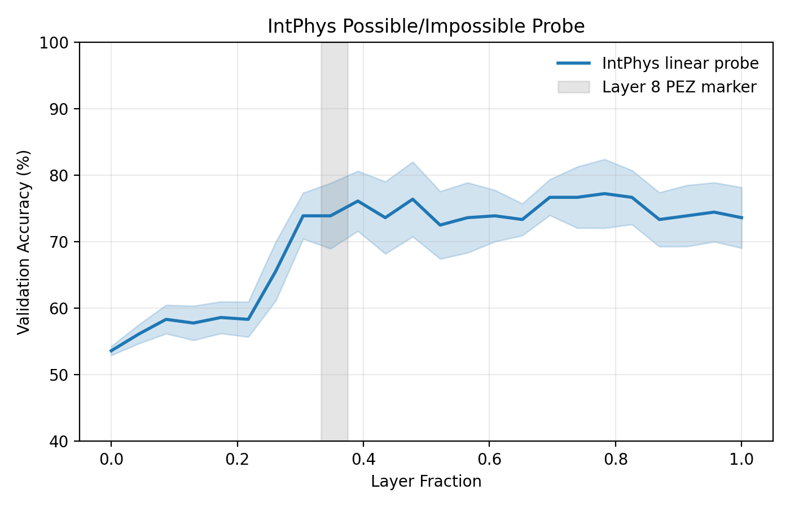
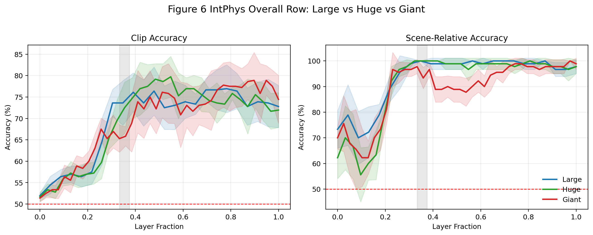

# PEZ Reproduction

This repository reproduces and stress-tests the main PEZ figures from
[pez_paper.pdf](/home/solee/pez/pez_paper.pdf) using local V-JEPA 2 checkpoints,
Kubric/PyBullet synthetic data, and IntPhys.

## Reproduction Guide

### Figure 2(c) Polar — qualified ✅

Best config:

| field | value |
| --- | --- |
| capture | `resid_post` |
| pooling | `temporal_last` |
| grouping | `direction_spatial_sector` |
| target | `angle` |
| norm | `zscore` |
| solver | `trainable (20 HP sweep)` |
| selected run | `fig2c_iter11_residpost_tlast_dirsector_angle` |

Expected metrics:

| probe | L0 | L8 | peak | late decline |
| --- | ---: | ---: | ---: | ---: |
| `speed` | `0.895` | `0.983` | `0.988 @ L19` | `0.988 -> 0.985` |
| `direction` | `0.326` | `0.816` | `0.876 @ L16` | `0.876 -> 0.835` |
| `acceleration` | `0.866` | `0.974` | `0.986 @ L20` | `0.986 -> 0.981` |

Expected runtime:
- `step1_generate.py`: about `2-3h` CPU Kubric render from scratch
- `step2_extract.py`: about `10-20 min` on one A6000
- `step3_probe.py`: about `5-15 min` on one A6000

Exact commands:

```bash
env PYTHONPATH=/home/solee/kubric blender --background --python /home/solee/pez/step1_generate.py -- --backend kubric
```

```bash
env CUDA_VISIBLE_DEVICES=0 PYTHONUNBUFFERED=1 /isaac-sim/python.sh /home/solee/pez/step2_extract.py \
  --capture resid_post \
  --transform resize \
  --pooling temporal_last \
  --output-root /home/solee/pez/artifacts/features/resid_post_resize_temporal_last \
  --device cuda:0
```

```bash
env CUDA_VISIBLE_DEVICES=1 PYTHONUNBUFFERED=1 /isaac-sim/python.sh /home/solee/pez/step3_probe.py run \
  --run-name fig2c_iter11_residpost_tlast_dirsector_angle \
  --feature-root /home/solee/pez/artifacts/features/resid_post_resize_temporal_last \
  --probe-set fig2c \
  --solver trainable \
  --norm-mode zscore \
  --grouping direction_spatial_sector \
  --direction-target angle \
  --residual-capture resid_post \
  --preprocessing resize \
  --device cuda:0
```

Hidden detail not explicit in the paper:
- `resid_post` worked better than naive `resid_pre`
- `temporal_last` was critical
- `angle` target worked better than `sin/cos`
- `direction_spatial_sector` grouping mattered for the PEZ onset

Output files:
- [results_fig2c_iter11_residpost_tlast_dirsector_angle.csv](/home/solee/pez/artifacts/results/results_fig2c_iter11_residpost_tlast_dirsector_angle.csv)
- [figure2c_final.png](/home/solee/pez/artifacts/results/figure2c_final.png)


### Figure 2(b) Cartesian — failed ❌

Verdict:
- no single coherent recipe matched the paper across both Cartesian probes
- best partial match required different configs for `velocity_xy` and `acceleration_xy`

Best partial configs:

| probe | capture | pooling | grouping | target | norm | solver | selected run |
| --- | --- | --- | --- | --- | --- | --- | --- |
| `velocity_xy` | `resid_post` | `temporal_last_patch` | `magnitude_spatial_sector` | `vxy` | `center` | `trainable (20 HP sweep)` | `fig2b_iter23_velocity_residpost_tlastpatch_magsector_center` |
| `acceleration_xy` | `resid_post` | `temporal_last` | `magnitude` | `vxy` | `center` | `trainable (20 HP sweep)` | `fig2b_iter16_accel_residpost_tlast_magnitude_center` |

Key metrics:

| probe | L0 | L8 | peak | late decline |
| --- | ---: | ---: | ---: | ---: |
| `velocity_xy` | `0.527` | `0.908` | `0.926 @ L12` | `0.926 -> 0.908` |
| `acceleration_xy` | `0.454` | `0.915` | `0.944 @ L21` | `0.944 -> 0.939` |

Why full reproduction failed:
- Cartesian targets were too sensitive to probe recipe changes
- `velocity_xy` and `acceleration_xy` did not share one best configuration
- our setup made Cartesian motion too linearly decodable in shallow layers
- the paper under-specifies readout, pooling, grouping, and target details

Commands:

```bash
env CUDA_VISIBLE_DEVICES=0 PYTHONUNBUFFERED=1 /isaac-sim/python.sh /home/solee/pez/step2_extract.py \
  --capture resid_post \
  --transform resize \
  --pooling temporal_last_patch \
  --output-root /home/solee/pez/artifacts/features/resid_post_resize_temporal_last_patch \
  --device cuda:0
```

```bash
env CUDA_VISIBLE_DEVICES=1 PYTHONUNBUFFERED=1 /isaac-sim/python.sh /home/solee/pez/step3_probe.py run \
  --run-name fig2b_iter23_velocity_residpost_tlastpatch_magsector_center \
  --feature-root /home/solee/pez/artifacts/features/resid_post_resize_temporal_last_patch \
  --probe-set fig2b_velocity_xy \
  --solver trainable \
  --norm-mode center \
  --grouping magnitude_spatial_sector \
  --direction-target vxy \
  --residual-capture resid_post \
  --preprocessing resize \
  --device cuda:0
```

```bash
env CUDA_VISIBLE_DEVICES=2 PYTHONUNBUFFERED=1 /isaac-sim/python.sh /home/solee/pez/step2_extract.py \
  --capture resid_post \
  --transform resize \
  --pooling temporal_last \
  --output-root /home/solee/pez/artifacts/features/resid_post_resize_temporal_last \
  --device cuda:0
```

```bash
env CUDA_VISIBLE_DEVICES=3 PYTHONUNBUFFERED=1 /isaac-sim/python.sh /home/solee/pez/step3_probe.py run \
  --run-name fig2b_iter16_accel_residpost_tlast_magnitude_center \
  --feature-root /home/solee/pez/artifacts/features/resid_post_resize_temporal_last \
  --probe-set fig2b_acceleration_xy \
  --solver trainable \
  --norm-mode center \
  --grouping magnitude \
  --direction-target vxy \
  --residual-capture resid_post \
  --preprocessing resize \
  --device cuda:0
```

Output files:
- [results_fig2b_iter23_velocity_residpost_tlastpatch_magsector_center.csv](/home/solee/pez/artifacts/results/results_fig2b_iter23_velocity_residpost_tlastpatch_magsector_center.csv)
- [results_fig2b_iter16_accel_residpost_tlast_magnitude_center.csv](/home/solee/pez/artifacts/results/results_fig2b_iter16_accel_residpost_tlast_magnitude_center.csv)
- [figure2b_final.png](/home/solee/pez/artifacts/results/figure2b_final.png)


### Figure 1 IntPhys possible/impossible — qualified ✅

Key point:
- use `scene-relative accuracy`
- do not use plain clip-level binary accuracy as the main selection metric

Best config:

| field | value |
| --- | --- |
| dataset | `IntPhys full dev` |
| capture | `resid_pre` |
| transform | `resize` |
| frames | `16-frame sample` |
| label | `possible vs impossible` |
| metric | `scene-relative accuracy` |
| solver | `trainable linear probe` |
| selected run | `intphys_possible_impossible_full_select_relative` |

Expected metrics:

| metric | L0 | L8 | peak | late decline |
| --- | ---: | ---: | ---: | ---: |
| `relative_accuracy` | `0.733` | `1.000` | `1.000` | `1.000 -> 1.000` |
| `clip_accuracy` | `0.519` | `0.736` | `0.769 @ L18` | `0.769 -> 0.728` |

Command:

```bash
env CUDA_VISIBLE_DEVICES=0 PYTHONUNBUFFERED=1 /isaac-sim/python.sh /home/solee/pez/step_intphys_probe.py \
  --device cuda:0 \
  --capture resid_pre \
  --transform resize \
  --batch-size 8 \
  --feature-root /home/solee/pez/artifacts/features/intphys_resid_pre_resize_fulldev \
  --reuse-features \
  --run-name intphys_possible_impossible_full_select_relative \
  --n-frames-sample 16 \
  --selection-metric relative_accuracy
```

Output files:
- [results_intphys_possible_impossible_full_select_relative.csv](/home/solee/pez/artifacts/results/results_intphys_possible_impossible_full_select_relative.csv)
- [summary_intphys_possible_impossible_full_select_relative.json](/home/solee/pez/artifacts/results/summary_intphys_possible_impossible_full_select_relative.json)
- [figure_intphys_possible_impossible_full_metrics16.png](/home/solee/pez/artifacts/results/figure_intphys_possible_impossible_full_metrics16.png)



### Figure 6 — overall-only partial reproduction ✅

What was reproduced:
- overall IntPhys row across `Large`, `Huge`, `Giant`

What was not fully reproduced:
- the full paper appendix panel with IntPhys subtasks
- local public resources do not expose the subtask mapping used for the full figure

Huge checkpoint download:

```bash
wget -c -O /mnt/md1/solee/checkpoints/vjepa2/vith.pt https://dl.fbaipublicfiles.com/vjepa2/vith.pt
```

Commands:

```bash
env CUDA_VISIBLE_DEVICES=0 PYTHONUNBUFFERED=1 /isaac-sim/python.sh /home/solee/pez/step_intphys_probe.py \
  --model large --device cuda:0 --capture resid_pre --transform resize --batch-size 8 \
  --run-name intphys_possible_impossible_full_select_relative --n-frames-sample 16 \
  --selection-metric relative_accuracy
```

```bash
env CUDA_VISIBLE_DEVICES=1 PYTHONUNBUFFERED=1 /isaac-sim/python.sh /home/solee/pez/step_intphys_probe.py \
  --model huge --device cuda:0 --capture resid_pre --transform resize --batch-size 4 \
  --feature-root /home/solee/pez/artifacts/features/intphys_vjepa2_H_resid_pre_resize_fulldev \
  --run-name figure6_intphys_huge_linear_full --n-frames-sample 16 --selection-metric relative_accuracy
```

```bash
env CUDA_VISIBLE_DEVICES=2 PYTHONUNBUFFERED=1 /isaac-sim/python.sh /home/solee/pez/step_intphys_probe.py \
  --model giant --device cuda:0 --capture resid_pre --transform resize --batch-size 4 \
  --run-name figure6_intphys_giant_linear_full --n-frames-sample 16 --selection-metric relative_accuracy
```

Output files:
- [figure6_intphys_overall_compare.csv](/home/solee/pez/artifacts/results/figure6_intphys_overall_compare.csv)
- [figure6_intphys_overall_compare.png](/home/solee/pez/artifacts/results/figure6_intphys_overall_compare.png)
- [figure6_verdict.md](/home/solee/pez/artifacts/results/figure6_verdict.md)



### Figure 8 — overall-only partial reproduction ✅

Pipeline:
- patch-preserving attentive probe
- token-level feature cache via `temporal_last_patch`
- IntPhys overall possible/impossible task

Best available local setup:

| field | value |
| --- | --- |
| extractor | `step_intphys_attentive.py` |
| capture | `resid_pre` |
| patch pooling | `temporal_last_patch` |
| probe | `AttentiveClassifier(depth=4, heads=16)` |
| split | `5-fold GroupKFold by scene_group` |
| output metric | `relative accuracy` and `clip accuracy` |

Commands:

```bash
env CUDA_VISIBLE_DEVICES=0 PYTHONUNBUFFERED=1 /isaac-sim/python.sh /home/solee/pez/step_intphys_attentive.py \
  --model large --device cuda:0 --capture resid_pre --transform resize \
  --patch-pool temporal_last_patch --batch-size 4 --probe-batch-size 16 \
  --n-frames-sample 16 --run-name figure8_intphys_large_attentive
```

```bash
env CUDA_VISIBLE_DEVICES=1 PYTHONUNBUFFERED=1 /isaac-sim/python.sh /home/solee/pez/step_intphys_attentive.py \
  --model huge --device cuda:0 --capture resid_pre --transform resize \
  --patch-pool temporal_last_patch --batch-size 2 --probe-batch-size 8 \
  --n-frames-sample 16 --run-name figure8_intphys_huge_attentive
```

```bash
env CUDA_VISIBLE_DEVICES=2 PYTHONUNBUFFERED=1 /isaac-sim/python.sh /home/solee/pez/step_intphys_attentive.py \
  --model giant --device cuda:0 --capture resid_pre --transform resize \
  --patch-pool temporal_last_patch --batch-size 2 --probe-batch-size 8 \
  --n-frames-sample 16 --run-name figure8_intphys_giant_attentive
```

Current overall summary:
- Large: `L0=0.0`, `L8=82.2%`, peak `88.9%@L10`
- Huge: `L0=0.0`, `L8=68.9%`, peak `86.7%@L16`
- Giant: `L0=0.0`, `L8=68.9%`, peak `87.8%@L21`

Output files:
- [figure8_intphys_overall_compare.csv](/home/solee/pez/artifacts/results/figure8_intphys_overall_compare.csv)
- [figure8_intphys_overall_compare.png](/home/solee/pez/artifacts/results/figure8_intphys_overall_compare.png)
- [figure8_verdict.md](/home/solee/pez/artifacts/results/figure8_verdict.md)


## Reproduction Notes

Paper-explicit spec:
- `16 frames`, `24 fps`, `256 x 256`
- synthetic ball videos rendered from Kubric/PyBullet/Blender
- layer-wise probing of V-JEPA 2
- linear probe with `20 HP` sweep
- `5-fold grouped CV`

Critical hidden detail we had to discover:
- exact residual capture point (`resid_pre` vs `resid_post`)
- exact temporal pooling (`mean` vs `temporal_last`)
- grouping semantics (`direction_spatial_sector`, `magnitude`, etc.)
- target parameterization (`angle` vs `sin/cos` vs `vxy`)
- patch-level vs mean-pooled readout
- IntPhys metric choice (`scene-relative accuracy` vs clip accuracy)

What mattered most after 24+ iterations:
- Figure 2(c) only became stable under `resid_post + temporal_last + angle + direction_spatial_sector`
- Figure 2(b) never collapsed to one universal recipe; `velocity_xy` and `acceleration_xy` wanted different pooling/grouping
- Figure 1 required `scene-relative accuracy`; clip accuracy alone looked like a failure
- Figure 6 and Figure 8 are best interpreted as `overall-only` reproductions with current public resources

Trade-offs:
- stronger late decline for Figure 2(c) usually came at the cost of a worse L8 onset
- Cartesian probes became too easy in shallow layers under some settings, which broke the paper-like mid-depth transition
- patch-level probing helped `velocity_xy` more than `acceleration_xy`
- attentive IntPhys worked well for `Large`, but scaled less cleanly to `Huge/Giant` in this local overall-only setup

## Current Pipeline

- [step1_generate.py](/home/solee/pez/step1_generate.py): paper-faithful synthetic ball data generation
- [step2_extract.py](/home/solee/pez/step2_extract.py): V-JEPA 2 feature extraction with capture/pooling ablations
- [step3_probe.py](/home/solee/pez/step3_probe.py): Figure 2 linear probes
- [step_intphys_probe.py](/home/solee/pez/step_intphys_probe.py): Figure 1 / Figure 6 linear IntPhys probes
- [step_intphys_attentive.py](/home/solee/pez/step_intphys_attentive.py): Figure 8 attentive IntPhys probes

## Archive

The pre-rewrite code and outputs remain under:
- [archive_pre_rewrite_260417/](/home/solee/pez/archive_pre_rewrite_260417)
